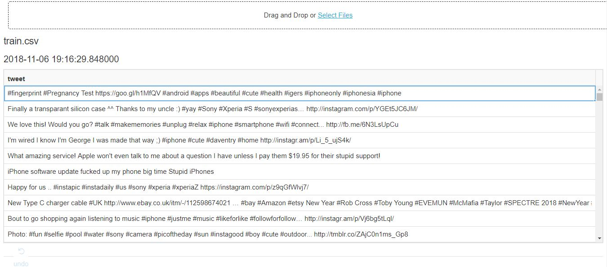

# Active-Learning-in-Text-classification
To Achieve  Active learning  in Text classification usecases ,Both the Transformers (Representation of the text ) and classifiers built upon the Representations should Learn actively ,i.e able to update itself with new data 

Text classification consists of two stages : 
- *Representation learning*
- *Classifiers*
To make the classifiers learn actively we need to introduce active learning in above two stages .
- ### Representation learning :
  - In this stage of the Text classification ,Text are cleaned ,normalized ,and converted into numerical value(Tensors).
  - Commonly used transformers are *TFIDF ,word2vec,Doc2vec (paragraph vectors)*.
  - With this transformers :TFIDF won't support active learning mechanisms since this is Count based feature transformer.
  - We can learn actively by using word2vec ,doc2vec ,or using latest state of art methodologies  introduced recently in the NLP space        such as *ULMFIT ,ELMO,BERT* etc
  - We also need a strategy to update the Vocabulary lookup as well (i.e one to one mapping between the word and numeric value)
- ### Classifiers:
  - Using continous learners such as Linear models with optimizers,Neural Networks adopts the new data on the fly.
  - While using Tree based models, are difficult to train actively (RandomForest ,Gradient boosting etc)
 
## Active learning in this Repository -Implementation details:
- ### Similarity method
- ### Custom classifier (which supports adding Extra class on the fly)
- ### Explanation for the classification results using **LIME*
This Repository consists of Dashboard made up of Dash & plotly for user Annotation, which is used to train the learning 
algorithm actively.

Steps taken to convert Unlabeled text data to labeled data in this demo are :
- Load the Text data
- Enter the sentence from the loaded text file 
- By using Similarity methods such as Cosine similarity , the system shows Similar text contents to the user .(*Unsupervised*)
- *Human Annotator (Oracle)* needs to annotate the class label for this similar text contents which will be saved and learned on the
  fly
- *Custom Classifier* (here KNN written from scratch) are used to learn the class label to Text content mapping .
  (KNN are used here because of its flexibility to add *New class to already trained model*)
  For example : if you train a classifier with two class,then if you have a new data for Third class, no need to train the 
  model from scratch, just add the class to the lookup table in KNN classifier,Since KNN is distance or similarity based approach it 
  chooses the relevant class based on the nearest neigbhours .
 ## Dashboard Interfaces:

### RoadMap:
- Try Different state of Art transformers such as *ULMFIT* (which is trained on entire Wikipedia ),*ELMO* ,*BERT*.
- Try *Neural Network* based Approach to add New Class to the already trained model .
- Integerate with **Shap** Interpretation as well to explain the Predictions to the User.
  
  
  
  
  
  

